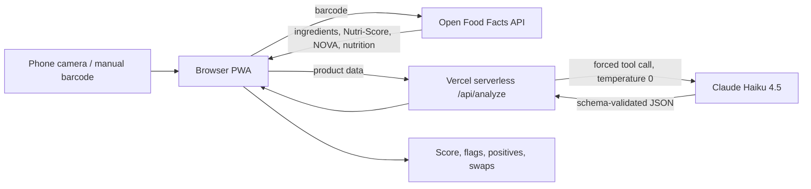

# 🌿 Ingredient Lens

Scan a food barcode, pull the product's real ingredient data, and get a plain-English AI analysis: a score, flagged ingredients, positives, and healthier swaps. It runs as an installable mobile web app (PWA).

**Live demo:** https://ingredient-lens-pearl.vercel.app (open on a phone, tap *Start Camera*, scan any packaged food)

## How it works



1. **Scan:** the browser's native `BarcodeDetector` reads the barcode (Chrome on Android). Browsers without it fall back to ZXing.
2. **Ground the AI in real data:** ingredients and nutrition come from [Open Food Facts](https://world.openfoodfacts.org), a crowd-sourced food database, so the model analyses a real label instead of guessing from a product name.
3. **Analyse on the server:** the page sends the product data to `/api/analyze`, which calls Claude.
4. **Render:** the structured result is shown as a score ring, categorised concerns, positives and swaps.

## Design decisions

| Decision | Why |
|---|---|
| **API key lives on the server**, not in the page | A browser-side key can be copied from DevTools by anyone. The serverless function holds it as an environment variable and validates and size-limits input. |
| **Forced tool call for structured output** | Claude must call a `report_analysis` tool with a JSON schema (score range, verdict enum, flag categories). This replaces parsing free text with regexes and removes malformed-JSON failures. |
| **Grounding rules in the system prompt** | The model may flag only ingredients that literally appear in the supplied list. With no list, it returns a neutral score and says so instead of inventing flags. |
| **Temperature 0** | Keeps results as repeatable as possible for a demo and for testing. |
| **Haiku 4.5 by default** | The task is short and structured, so a small fast model gives ~5 s responses at a fraction of a cent per scan. The model can be changed with the `ANALYZE_MODEL` environment variable. |
| **All rendered text is HTML-escaped** | Open Food Facts is crowd-edited, and model output is untrusted. Both are escaped before display to prevent script injection. |
| **Network-first service worker, with a versioned cache** | Deployed updates show up immediately, and the app shell still loads offline. API and data calls are never cached. |
| **No build step** | One static page plus one function keeps it easy to read, deploy and explain. |

## Tested behaviour

- Live API tested against real Open Food Facts products (Oreo, Coca-Cola, Nutella): every flagged ingredient was found in the real ingredient list.
- A product with no ingredient data returns a neutral score of 50 and no flags.
- A plain-oats product scores 95 (CLEAN).
- Camera scanning tested on Chrome for Android.

## Known limitations (honest list)

- **The score is LLM-generated and compressed.** Oreo, Coca-Cola and Nutella all scored 28, so it doesn't separate a cookie from a soda. The flag count can also vary by one between runs at temperature 0. This is the main thing to fix next (see below).
- **Data quality depends on Open Food Facts.** Some products lack ingredients, and some are in other languages.
- **No authentication or rate limiting** on `/api/analyze` beyond input-size limits, so it isn't production-hardened.
- **Not medical or dietary advice.** It is general information only.

## Roadmap

1. **Deterministic scoring:** build the 0–100 score from Nutri-Score, NOVA group and additive counts, and use the LLM only for the explanation. This makes scores consistent, testable and cheap to explain.
2. **Evaluation script:** run ~20 fixed barcodes and check score stability, schema validity, and that every flagged ingredient appears in the source text.
3. **Allergy and diet profile:** highlight products that conflict with the user's restrictions.
4. **Per-barcode caching and rate limiting** for lower cost and abuse protection.
5. **Compare mode:** scan two products side by side.

## Run it yourself

```bash
npm i -g vercel
vercel login
vercel env add ANTHROPIC_API_KEY      # your key from console.anthropic.com
vercel dev                             # local, http://localhost:3000
vercel deploy --prod
```

Camera access needs HTTPS (or `localhost`). Get an API key at <https://console.anthropic.com>. Never commit keys; `.env` is git-ignored.

## Project layout

```
index.html        UI, scanner, Open Food Facts lookup, rendering
api/analyze.js    Serverless function: prompt, tool schema, Claude call
sw.js             Service worker (network-first, versioned cache)
manifest.json     PWA manifest
icons/            App icons
```

## Tech

Vanilla HTML/CSS/JS · Vercel serverless (Node) · Anthropic Claude API · Open Food Facts API · BarcodeDetector API with ZXing fallback · PWA
