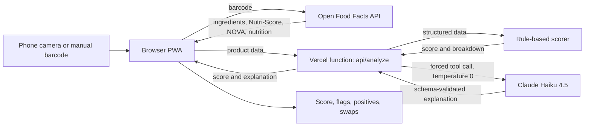

# 🌿 Ingredient Lens

Scan a food barcode, pull the product's real ingredient data, and get a plain-English AI analysis: a score, flagged ingredients, positives, and healthier swaps. It runs as an installable mobile web app (PWA).

## How it works



1. **Scan:** the browser's native `BarcodeDetector` reads the barcode (Chrome on Android). Browsers without it fall back to ZXing.
2. **Ground the AI in real data:** ingredients and nutrition come from [Open Food Facts](https://world.openfoodfacts.org), a crowd-sourced food database, so the model analyses a real label instead of guessing from a product name.
3. **Score, then explain, on the server:** `/api/analyze` computes the 0–100 score with deterministic rules (`lib/score.js`), then asks Claude to explain it: a summary, flagged ingredients, positives and swaps.
4. **Cache, compare, remember:** results are cached on the device for 7 days (repeat scans are instant and skip the AI call), any two products can be compared side by side, and history and allergen preferences are kept in `localStorage`.
5. **Render:** the result is shown as a score ring, categorised concerns, positives, swaps and a **Score tab** that lists exactly how the number was built.

## Design decisions

| Decision | Why |
|---|---|
| **API key lives on the server**, not in the page | A browser-side key can be copied from DevTools by anyone. The serverless function holds it as an environment variable and validates and size-limits input. |
| **Forced tool call for structured output** | Claude must call a `report_analysis` tool with a JSON schema (score range, verdict enum, flag categories). This replaces parsing free text with regexes and removes malformed-JSON failures. |
| **Score is computed in code, not by the LLM** | An earlier version let Claude set the score and it bunched bad products together (Oreo, Coca-Cola and Nutella all got 28). Rules over Nutri-Score, NOVA, sugar, saturated fat, salt and additive count make it repeatable, unit-tested and explainable. The LLM only explains it. |
| **Grounding rules in the system prompt** | The model may flag only ingredients that literally appear in the supplied list. With no list, it returns a neutral score and says so instead of inventing flags. |
| **Temperature 0** | Keeps results as repeatable as possible for a demo and for testing. |
| **Haiku 4.5 by default** | The task is short and structured, so a small fast model gives ~5 s responses at a fraction of a cent per scan. The model can be changed with the `ANALYZE_MODEL` environment variable. |
| **All rendered text is HTML-escaped** | Open Food Facts is crowd-edited, and model output is untrusted. Both are escaped before display to prevent script injection. |
| **Network-first service worker, with a versioned cache** | Deployed updates show up immediately, and the app shell still loads offline. API and data calls are never cached. |
| **On-device cache, history and preferences** | `localStorage` keeps results by barcode (7-day expiry), the last 20 scans and the user's allergens. It needs no accounts or server storage, and nothing leaves the phone. The trade-off is that it isn't shared across devices. |
| **Deterministic compare** | The winner and the per-factor table come from the rule-based scores, not from the LLM. A separate short Claude call only writes a 2-sentence summary, and the view works without it. |
| **Per-IP rate limiting** | Both API routes share a limit (30 requests per 10 min by default). It uses Redis if Upstash is connected, otherwise in-memory counts per instance, which is best effort only. |
| **No build step** | One static page plus one function keeps it easy to read, deploy and explain. |

## Tested behaviour

- `npm test` runs 12 unit tests: scoring (determinism, clamping to 0–100, missing data, garbage input, distinct scores for different bad products) and the rate limiter (limits, per-key counting, window reset).
- Cache, history, allergen alert and compare mode were exercised in a browser against a mock API.
- Live API tested against real Open Food Facts products: every flagged ingredient was found in the real ingredient list.
- Example scores: Oreo 13, Kraft Mac 24, Nutella 25, Coca-Cola 26, Doritos 48, plain oats 95. A product with no data returns a neutral 50 with low confidence.
- Camera scanning tested on Chrome for Android.

## Known limitations (honest list)

- **The scoring weights are my judgment**, loosely modelled on Nutri-Score ideas, not a validated clinical standard. They are simple, visible in the Score tab and easy to change.
- **Data quality depends on Open Food Facts.** Some products lack ingredients, Nutri-Score or NOVA, and some are in other languages. Low-data products get a low-confidence label.
- **The AI explanation isn't machine-verified.** I checked flagged ingredients against the source list by hand on sample products; there is no automated evaluation yet.
- **No authentication or rate limiting** on `/api/analyze` beyond input-size limits, so it isn't production-hardened.
- **Not medical or dietary advice.** It is general information only.

## Roadmap

1. **Evaluation script:** run ~20 fixed barcodes and check schema validity and that every flagged ingredient appears in the source text.
2. **Provider-pluggable model layer** (for example an OpenAI-compatible gateway) for fallback and cost control.
3. **Accounts and a database** for history and preferences across devices, plus a shared server-side barcode cache.
4. **Connect Redis** so the rate limit holds across all server instances.
5. **Photograph the ingredient label** (vision) for products missing from Open Food Facts.

## Run it yourself

```bash
npm i -g vercel
vercel login
vercel env add ANTHROPIC_API_KEY      # your key from console.anthropic.com
vercel dev                             # local, http://localhost:3000
vercel deploy --prod
```

Camera access needs HTTPS (or `localhost`). Get an API key at <https://console.anthropic.com>. Never commit keys; `.env` is git-ignored.

## Project layout

```
index.html        UI, scanner, Open Food Facts lookup, rendering
api/analyze.js    Serverless function: prompt, tool schema, Claude call
api/compare.js    Serverless function: short AI summary for compare mode
lib/ratelimit.js  Per-IP rate limiter (Redis or in-memory)
lib/score.js      Deterministic scoring rules
test/             Unit tests (npm test)
sw.js             Service worker (network-first, versioned cache)
manifest.json     PWA manifest
icons/            App icons
```

## Tech

Vanilla HTML/CSS/JS · Node test runner · Vercel serverless (Node) · Anthropic Claude API · Open Food Facts API · BarcodeDetector API with ZXing fallback · PWA
